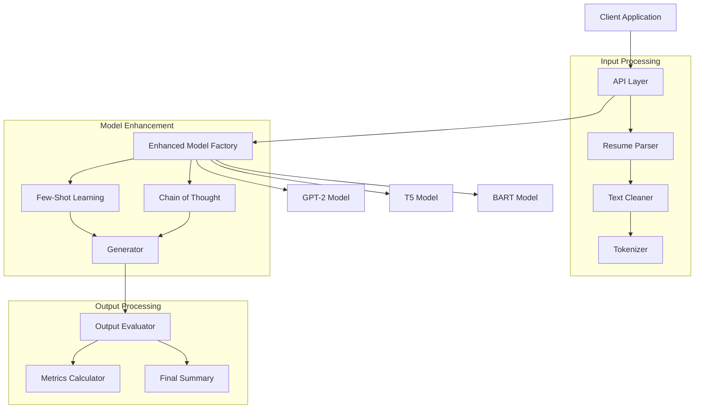

# Resume Summary Generator with ML-Enhanced Cleanup

A sophisticated resume summary generation system that uses transformer models with few-shot learning and chain-of-thought reasoning for high-quality outputs.

## Architecture



For detailed documentation of all components, please refer to the [docs](./docs) directory.

## Features

### Core Functionality
- **Multiple Model Support**: GPT-2 implementation (T5 and BART planned)
- **Enhanced Generation**:
  - Few-shot learning
  - Chain-of-thought reasoning

### Project Structure
```
tv3/
├── src/
│   ├── models/
│   │   ├── gpt2_model.py      # GPT-2 model implementation
│   │   └── enhanced_model_factory.py  # Model factory with enhancements
│   ├── parsers/
│   │   └── parser_factory.py  # Resume parser implementations
│   ├── config/
│   │   └── model_prompts.py   # Model prompts and configurations
│   └── generate_summary.py     # Main generation script
├── data/
├── logs/
├── models/                   # Trained models
└── exported_models/          # Deployment-ready models
```

## Installation

1. Clone the repository:
```bash
git clone https://github.com/yourusername/tv3.git
cd tv3
```

2. Install dependencies:
```bash
pip install -r requirements.txt
```

## Usage

### Basic Summary Generation
```python
from src.generate_summary import generate_summary

# Generate summary from resume
summary = generate_summary("path/to/resume.pdf")
```

## Model Training Pipeline

1. **Data Preparation**:
   - Parse resume templates
   - Create training pairs
   - Split into train/validation sets

2. **Model Training**:
   - Cross-validation
   - Early stopping
   - Checkpointing
   - Multiple metrics tracking

3. **Evaluation**:
   - BLEU score
   - METEOR score
   - ROUGE scores
   - BERTScore
   - Style consistency

## Contributing

1. Fork the repository
2. Create your feature branch (`git checkout -b feature/AmazingFeature`)
3. Commit your changes (`git commit -m 'Add some AmazingFeature'`)
4. Push to the branch (`git push origin feature/AmazingFeature`)
5. Open a Pull Request

## License

This project is licensed under the MIT License - see the LICENSE file for details.

## Acknowledgments

- Hugging Face Transformers library
- Sentence Transformers
- Optuna optimization framework
- NLTK and spaCy for NLP tasks
