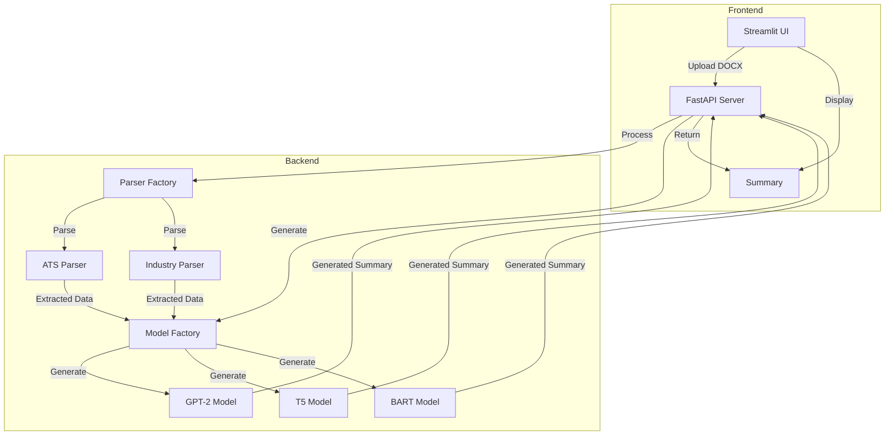
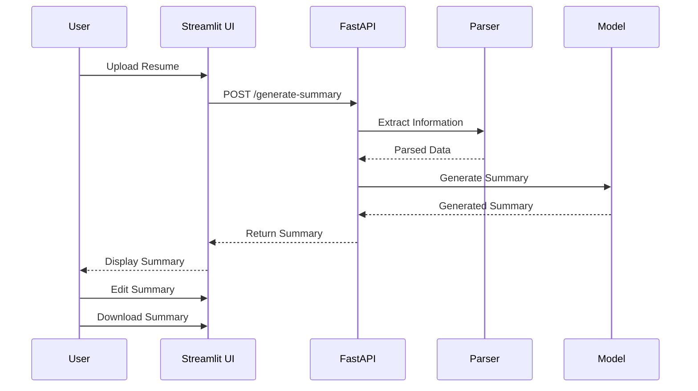

# Resume Summary Generator

A powerful application that generates professional summaries from resumes using advanced language models.

## Architecture Diagram


## Flow Diagram


## Features

- 📄 Support for DOCX resume files
- 🤖 Multiple AI models (GPT-2, T5, BART)
- 🎯 Specialized parsers (ATS, Industry)
- 🌐 RESTful API
- 🖥️ User-friendly web interface
- ✏️ Editable summaries
- 💾 Download functionality

## Quick Start

1. **Clone the repository:**
   ```bash
   git clone https://github.com/yourusername/resume-summary.git
   cd resume-summary
   ```

2. **Using Docker:**
   ```bash
   docker build -t resume-summary .
   docker run -p 8000:8000 -p 8501:8501 resume-summary
   ```

3. **Manual Setup:**
   ```bash
   pip install -r requirements.txt
   ```

4. **Run the applications:**
   ```bash
   # Start FastAPI server
   uvicorn src.api.main:app --reload

   # Start Streamlit app
   streamlit run src/streamlit_app.py
   ```

## Usage

1. Open the Streamlit interface at http://localhost:8501
2. Upload a DOCX resume file
3. Select model and parser type
4. Click "Generate Summary"
5. Edit the generated summary if needed
6. Download the final summary

## API Documentation

The FastAPI server provides these endpoints:
- `POST /generate-summary/`: Generate summary from resume
- `GET /models`: List available models
- `GET /parsers`: List available parsers
- `GET /health`: Health check

Detailed API documentation available at http://localhost:8000/docs

## Project Structure
```
resume-summary/
├── src/
│   ├── api/              # FastAPI application
│   ├── models/           # AI models
│   ├── parsers/          # Resume parsers
│   ├── templates/        # Resume templates
│   ├── utils/            # Utility functions
│   ├── generate_summary.py
│   └── streamlit_app.py
├── docs/                 # Documentation
├── tests/               # Test files
├── Dockerfile          # Docker configuration
├── requirements.txt    # Python dependencies
└── README.md
```

## Development

### Testing
```bash
pytest tests/
```

### Code Style
```bash
flake8 src/
```

## Deployment

The application can be deployed to various cloud platforms:
- AWS ECS/EKS
- Google Cloud Run
- Azure Container Apps

## Contributing

1. Fork the repository
2. Create your feature branch
3. Commit your changes
4. Push to the branch
5. Create a Pull Request

## License

This project is licensed under the MIT License - see the LICENSE file for details.

## Documentation

- [Architecture Documentation](docs/architecture.md)
- [API Documentation](docs/api.md)

## Authors

- Your Name - Initial work

## Acknowledgments

- OpenAI for GPT-2
- Google for T5
- Facebook for BART
