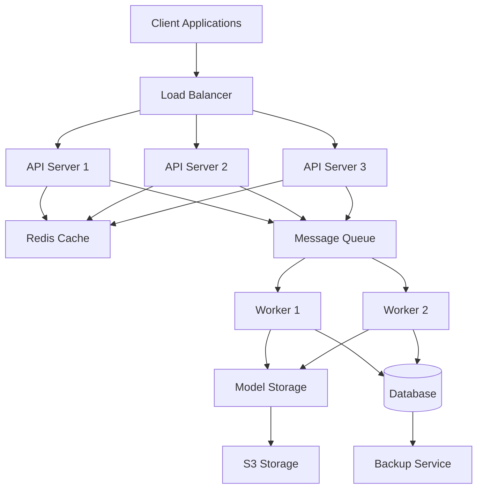
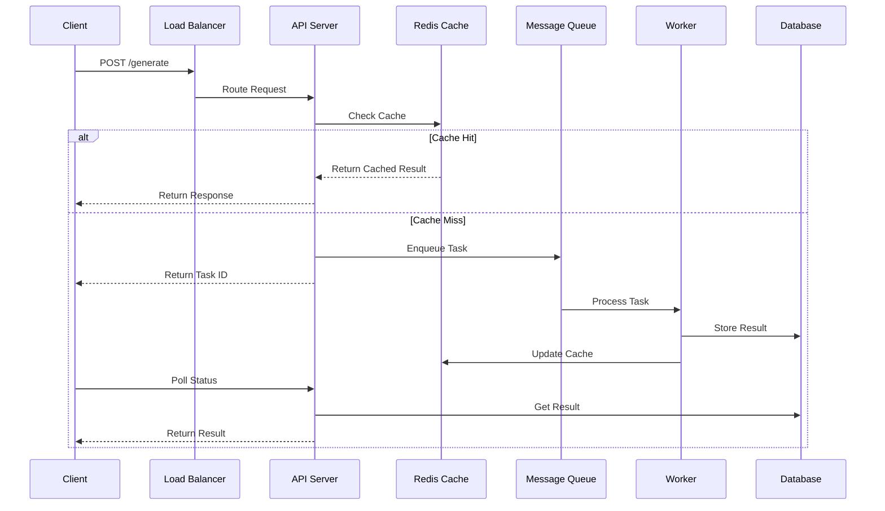
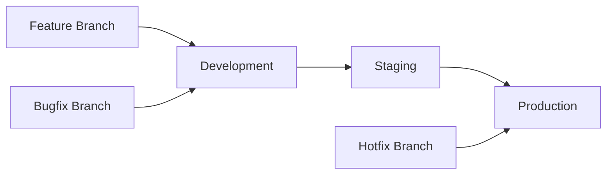
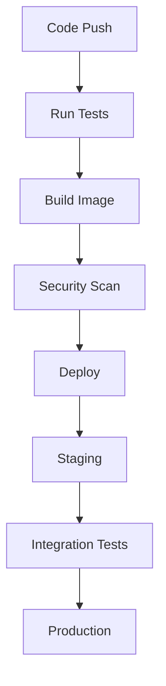

# Resume Summary Generator with ML-Enhanced Cleanup

A sophisticated resume summary generation system that uses transformer models with few-shot learning and chain-of-thought reasoning for high-quality outputs.

## Features

### Core Functionality
- **Multiple Model Support**: GPT-2 implementation (T5 and BART planned)
- **Enhanced Generation**:
  - Few-shot learning
  - Chain-of-thought reasoning

### Project Structure
```
tv3/
├── src/
│   ├── models/
│   │   ├── gpt2_model.py      # GPT-2 model implementation
│   │   └── enhanced_model_factory.py  # Model factory with enhancements
│   ├── parsers/
│   │   └── parser_factory.py  # Resume parser implementations
│   ├── config/
│   │   └── model_prompts.py   # Model prompts and configurations
│   └── generate_summary.py     # Main generation script
├── data/
├── logs/
├── models/                   # Trained models
└── exported_models/          # Deployment-ready models
```

## Installation

1. Clone the repository:
```bash
git clone https://github.com/yourusername/tv3.git
cd tv3
```

2. Install dependencies:
```bash
pip install -r requirements.txt
```

## Usage

### Basic Summary Generation
```python
from src.generate_summary import generate_summary

# Generate summary from resume
summary = generate_summary("path/to/resume.pdf")
```

## Model Training Pipeline

1. **Data Preparation**:
   - Parse resume templates
   - Create training pairs
   - Split into train/validation sets

2. **Model Training**:
   - Cross-validation
   - Early stopping
   - Checkpointing
   - Multiple metrics tracking

3. **Evaluation**:
   - BLEU score
   - METEOR score
   - ROUGE scores
   - BERTScore
   - Style consistency

## Contributing

1. Fork the repository
2. Create your feature branch (`git checkout -b feature/AmazingFeature`)
3. Commit your changes (`git commit -m 'Add some AmazingFeature'`)
4. Push to the branch (`git push origin feature/AmazingFeature`)
5. Open a Pull Request

## License

This project is licensed under the MIT License - see the LICENSE file for details.

## Acknowledgments

- Hugging Face Transformers library
- Sentence Transformers
- Optuna optimization framework
- NLTK and spaCy for NLP tasks

## API Documentation

### Model Factory API

#### EnhancedModelFactory
```python
class EnhancedModelFactory:
    """Factory for creating and managing enhanced language models."""
    
    def __init__(
        self,
        model_type: str,
        cleanup_enhancer: Optional[MLCleanupEnhancer] = None,
        config: Optional[Dict] = None
    ):
        """
        Args:
            model_type: Type of model ('gpt2', 't5', 'bart')
            cleanup_enhancer: Optional ML cleanup enhancer
            config: Optional model configuration
        """
        
    def generate_with_rag(
        self,
        input_text: str,
        reference_docs: List[str],
        num_references: int = 3
    ) -> str:
        """Generate text using RAG approach.
        
        Args:
            input_text: Input text to generate from
            reference_docs: List of reference documents
            num_references: Number of references to use
            
        Returns:
            Generated text
        """
        
    def generate_with_examples(
        self,
        input_text: str,
        examples: List[Dict[str, str]]
    ) -> str:
        """Generate text using few-shot examples.
        
        Args:
            input_text: Input text to generate from
            examples: List of example pairs (input/output)
            
        Returns:
            Generated text
        """
        
    def generate_with_cot(
        self,
        input_text: str,
        reasoning_steps: List[str]
    ) -> str:
        """Generate text using chain-of-thought reasoning.
        
        Args:
            input_text: Input text to generate from
            reasoning_steps: List of reasoning step names
            
        Returns:
            Generated text
        """
```

### ML Cleanup API

#### MLCleanupEnhancer
```python
class MLCleanupEnhancer:
    """ML-based text cleanup and enhancement."""
    
    def __init__(
        self,
        quality_model: str = 'microsoft/deberta-v3-base',
        style_model: str = 'sentence-transformers/all-mpnet-base-v2',
        cleanup_model: str = 't5-base',
        config: Optional[Dict] = None
    ):
        """
        Args:
            quality_model: Model for quality scoring
            style_model: Model for style matching
            cleanup_model: Model for text cleanup
            config: Optional configuration
        """
        
    def clean_output(
        self,
        text: str,
        style_example: Optional[str] = None,
        min_quality: float = 0.7
    ) -> str:
        """Clean and enhance text output.
        
        Args:
            text: Text to clean
            style_example: Optional style reference
            min_quality: Minimum quality threshold
            
        Returns:
            Cleaned text
        """
        
    def batch_clean(
        self,
        texts: List[str],
        style_examples: Optional[List[str]] = None
    ) -> List[str]:
        """Clean multiple texts in batch.
        
        Args:
            texts: List of texts to clean
            style_examples: Optional style references
            
        Returns:
            List of cleaned texts
        """
```

### Training API

#### CleanupTrainer
```python
class CleanupTrainer:
    """Trainer for ML cleanup models."""
    
    def __init__(
        self,
        model_name: str,
        train_data: str,
        val_data: str,
        config: Optional[Dict] = None
    ):
        """
        Args:
            model_name: Name of model to train
            train_data: Path to training data
            val_data: Path to validation data
            config: Optional training configuration
        """
        
    def train(
        self,
        callbacks: Optional[List[Callback]] = None
    ) -> Dict[str, List[float]]:
        """Train the model.
        
        Args:
            callbacks: Optional training callbacks
            
        Returns:
            Training history
        """
```

## Deployment Guide

### Docker Deployment

1. **Build Docker Image**
```dockerfile
# Dockerfile
FROM pytorch/pytorch:1.9.0-cuda11.1-cudnn8-runtime

# Install dependencies
COPY requirements.txt .
RUN pip install -r requirements.txt

# Copy application code
COPY . /app
WORKDIR /app

# Set environment variables
ENV MODEL_PATH=/app/models
ENV CUDA_VISIBLE_DEVICES=0

# Expose port
EXPOSE 8000

# Run application
CMD ["python", "src/app.py"]
```

2. **Build and Run**
```bash
# Build image
docker build -t resume-summary-generator .

# Run container
docker run -d \
    -p 8000:8000 \
    -v /path/to/models:/app/models \
    --gpus all \
    resume-summary-generator
```

### Kubernetes Deployment

1. **Create Deployment**
```yaml
# deployment.yaml
apiVersion: apps/v1
kind: Deployment
metadata:
  name: resume-summary
spec:
  replicas: 3
  selector:
    matchLabels:
      app: resume-summary
  template:
    metadata:
      labels:
        app: resume-summary
    spec:
      containers:
      - name: resume-summary
        image: resume-summary-generator:latest
        ports:
        - containerPort: 8000
        resources:
          limits:
            nvidia.com/gpu: 1
        volumeMounts:
        - name: models
          mountPath: /app/models
      volumes:
      - name: models
        persistentVolumeClaim:
          claimName: models-pvc
```

2. **Create Service**
```yaml
# service.yaml
apiVersion: v1
kind: Service
metadata:
  name: resume-summary
spec:
  selector:
    app: resume-summary
  ports:
  - port: 80
    targetPort: 8000
  type: LoadBalancer
```

3. **Deploy**
```bash
kubectl apply -f deployment.yaml
kubectl apply -f service.yaml
```

### Cloud Deployment (AWS)

1. **Build for Lambda**
```python
# lambda_function.py
import json
from src.generate_summary import generate_summary

def lambda_handler(event, context):
    try:
        body = json.loads(event['body'])
        resume_text = body['resume']
        
        summary = generate_summary(resume_text)
        
        return {
            'statusCode': 200,
            'body': json.dumps({'summary': summary})
        }
    except Exception as e:
        return {
            'statusCode': 500,
            'body': json.dumps({'error': str(e)})
        }
```

2. **Create API Gateway**
```bash
# Create REST API
aws apigateway create-rest-api \
    --name "ResumeSummaryAPI" \
    --region us-west-2

# Create resource and method
aws apigateway create-resource \
    --rest-api-id <api-id> \
    --parent-id <parent-id> \
    --path-part "generate"

aws apigateway put-method \
    --rest-api-id <api-id> \
    --resource-id <resource-id> \
    --http-method POST \
    --authorization-type NONE
```

3. **Deploy with CloudFormation**
```yaml
# template.yaml
AWSTemplateFormatVersion: '2010-09-09'
Transform: AWS::Serverless-2016-10-31

Resources:
  ResumeSummaryFunction:
    Type: AWS::Serverless::Function
    Properties:
      Handler: lambda_function.lambda_handler
      Runtime: python3.8
      MemorySize: 3008
      Timeout: 30
      Events:
        Api:
          Type: Api
          Properties:
            Path: /generate
            Method: POST
```

## Additional Cloud Deployments

### Google Cloud Platform (GCP)

1. **Cloud Run Deployment**
```dockerfile
# Dockerfile.gcp
FROM pytorch/pytorch:1.9.0-cuda11.1-cudnn8-runtime

# Install dependencies
COPY requirements.txt .
RUN pip install -r requirements.txt

# Copy application code
COPY . /app
WORKDIR /app

# Set environment variables
ENV PORT=8080

# Run with gunicorn
CMD exec gunicorn --bind :$PORT src.app:app
```

```bash
# Build and deploy
gcloud builds submit --tag gcr.io/PROJECT_ID/resume-summary
gcloud run deploy resume-summary \
    --image gcr.io/PROJECT_ID/resume-summary \
    --platform managed \
    --memory 2Gi \
    --cpu 2
```

2. **AI Platform**
```yaml
# config.yaml
trainingInput:
  scaleTier: CUSTOM
  masterType: n1-highmem-8
  masterConfig:
    acceleratorConfig:
      count: 1
      type: NVIDIA_TESLA_T4
  hyperparameters:
    goal: MAXIMIZE
    hyperparameterMetricTag: val_rouge_l
    maxTrials: 50
    maxParallelTrials: 3
```

```bash
# Submit training job
gcloud ai-platform jobs submit training cleanup_job \
    --config config.yaml \
    --package-path src/ \
    --module-name training.train_cleanup \
    --region us-central1 \
    --runtime-version 2.6 \
    --python-version 3.8
```

### Microsoft Azure

1. **Azure Container Instances**
```bash
# Create container
az container create \
    --resource-group myResourceGroup \
    --name resume-summary \
    --image resume-summary:latest \
    --cpu 2 \
    --memory 4 \
    --registry-login-server myregistry.azurecr.io \
    --registry-username <username> \
    --registry-password <password> \
    --dns-name-label resume-summary \
    --ports 80
```

2. **Azure ML Service**
```python
# azure_deploy.py
from azureml.core import Workspace, Environment, Model
from azureml.core.model import InferenceConfig
from azureml.core.webservice import AciWebservice

# Configure workspace
ws = Workspace.from_config()

# Create environment
env = Environment.from_pip_requirements("resume-env", "requirements.txt")

# Create inference config
inference_config = InferenceConfig(
    entry_script="src/deploy/score.py",
    environment=env
)

# Deploy to ACI
aci_config = AciWebservice.deploy_configuration(
    cpu_cores=2,
    memory_gb=4,
    auth_enabled=True
)

service = Model.deploy(
    ws,
    "resume-summary",
    [model],
    inference_config,
    aci_config
)
```

## Performance Optimization

### 1. Model Optimization

#### Quantization
```python
from torch.quantization import quantize_dynamic

# Quantize model
quantized_model = quantize_dynamic(
    model,
    {torch.nn.Linear},
    dtype=torch.qint8
)

# Save quantized model
torch.save(quantized_model.state_dict(), "models/quantized.pth")
```

#### Model Pruning
```python
from torch.nn.utils import prune

# Prune model
for name, module in model.named_modules():
    if isinstance(module, torch.nn.Linear):
        prune.l1_unstructured(module, name='weight', amount=0.3)
```

#### Model Distillation
```python
class DistillationTrainer:
    def __init__(self, teacher_model, student_model):
        self.teacher = teacher_model
        self.student = student_model
        
    def train_step(self, batch):
        # Teacher predictions
        with torch.no_grad():
            teacher_logits = self.teacher(batch)
            
        # Student training
        student_logits = self.student(batch)
        
        # Distillation loss
        distill_loss = self.distillation_loss(
            student_logits,
            teacher_logits,
            temperature=2.0
        )
        
        return distill_loss
```

### 2. Inference Optimization

#### Batch Processing
```python
class BatchProcessor:
    def __init__(self, model, batch_size=32):
        self.model = model
        self.batch_size = batch_size
        
    def process_large_dataset(self, data):
        results = []
        for batch in self.create_batches(data):
            # Process batch
            batch_results = self.model.generate_batch(
                batch,
                max_length=self.max_length,
                num_return_sequences=1
            )
            results.extend(batch_results)
        return results
        
    def create_batches(self, data):
        for i in range(0, len(data), self.batch_size):
            yield data[i:i + self.batch_size]
```

#### Caching
```python
from functools import lru_cache
import redis

class CacheManager:
    def __init__(self):
        self.redis_client = redis.Redis(host='localhost', port=6379)
        
    @lru_cache(maxsize=1000)
    def get_cached_summary(self, text_hash):
        """Get cached summary using memory cache."""
        pass
        
    def get_redis_summary(self, text_hash):
        """Get cached summary using Redis."""
        return self.redis_client.get(text_hash)
        
    def cache_summary(self, text_hash, summary):
        """Cache summary in both memory and Redis."""
        self.redis_client.set(text_hash, summary)
```

#### Async Processing
```python
import asyncio
from concurrent.futures import ThreadPoolExecutor

class AsyncProcessor:
    def __init__(self, model, max_workers=4):
        self.model = model
        self.executor = ThreadPoolExecutor(max_workers=max_workers)
        
    async def process_async(self, texts):
        loop = asyncio.get_event_loop()
        tasks = [
            loop.run_in_executor(
                self.executor,
                self.model.generate,
                text
            )
            for text in texts
        ]
        return await asyncio.gather(*tasks)
```

### 3. Memory Management

#### Gradient Checkpointing
```python
from torch.utils.checkpoint import checkpoint

class MemoryEfficientModel(torch.nn.Module):
    def forward(self, x):
        # Use checkpointing for memory-intensive layers
        h1 = checkpoint(self.layer1, x)
        h2 = checkpoint(self.layer2, h1)
        return self.layer3(h2)
```

#### Memory Monitoring
```python
import psutil
import torch

class MemoryMonitor:
    @staticmethod
    def log_memory_stats():
        process = psutil.Process()
        print(f"CPU Memory: {process.memory_info().rss / 1024 / 1024:.2f} MB")
        if torch.cuda.is_available():
            print(f"GPU Memory: {torch.cuda.memory_allocated() / 1024 / 1024:.2f} MB")
            
    @staticmethod
    def clear_cache():
        if torch.cuda.is_available():
            torch.cuda.empty_cache()
```

## Additional Use Cases

### 6. Multi-Language Resumes
```python
from transformers import MarianMTModel, MarianTokenizer

class MultilingualProcessor:
    def __init__(self):
        self.translation_model = MarianMTModel.from_pretrained(
            'Helsinki-NLP/opus-mt-ROMANCE-en'
        )
        self.tokenizer = MarianTokenizer.from_pretrained(
            'Helsinki-NLP/opus-mt-ROMANCE-en'
        )
        
    def translate_and_summarize(self, text, source_lang):
        # Translate to English
        translated = self.translate(text, source_lang)
        
        # Generate summary
        summary = self.model.generate(translated)
        
        return summary
```

### 7. Industry-Specific Summaries
```python
class IndustrySpecificGenerator:
    def __init__(self, industry):
        self.industry = industry
        self.load_industry_config()
        
    def generate_summary(self, resume):
        # Apply industry-specific processing
        processed = self.apply_industry_rules(resume)
        
        # Generate with industry context
        summary = self.model.generate_with_context(
            processed,
            industry_context=self.industry_context
        )
        
        return summary
```

### 8. ATS Optimization
```python
class ATSOptimizer:
    def __init__(self, job_description):
        self.job_description = job_description
        self.keywords = self.extract_keywords()
        
    def optimize_summary(self, summary):
        # Ensure keyword inclusion
        optimized = self.include_keywords(summary)
        
        # Format for ATS
        formatted = self.format_for_ats(optimized)
        
        return formatted
```

### 9. Role Transition Emphasis
```python
class TransitionEmphasis:
    def __init__(self, source_role, target_role):
        self.source = source_role
        self.target = target_role
        
    def emphasize_transition(self, resume):
        # Identify transferable skills
        skills = self.find_transferable_skills()
        
        # Generate transition-focused summary
        summary = self.model.generate_with_emphasis(
            resume,
            target_role=self.target,
            key_skills=skills
        )
        
        return summary
```

### 10. Timeline-Based Summaries
```python
class TimelineGenerator:
    def __init__(self, time_window=5):
        self.time_window = time_window
        
    def generate_timeline_summary(self, resume):
        # Extract timeline
        timeline = self.extract_timeline(resume)
        
        # Focus on recent experience
        recent = self.filter_recent(timeline)
        
        # Generate progressive summary
        summary = self.model.generate_with_timeline(
            recent,
            progression_focus=True
        )
        
        return summary
```

## Monitoring and Observability

### 1. Prometheus Metrics
```python
from prometheus_client import Counter, Histogram, start_http_server
import time

class MetricsCollector:
    def __init__(self):
        # Request metrics
        self.request_counter = Counter(
            'resume_requests_total',
            'Total resume processing requests',
            ['model_type', 'status']
        )
        
        # Latency metrics
        self.generation_time = Histogram(
            'generation_duration_seconds',
            'Time spent generating summaries',
            ['model_type']
        )
        
        # Model metrics
        self.token_counter = Counter(
            'tokens_generated_total',
            'Total tokens generated',
            ['model_type']
        )
        
    def track_request(self, model_type, status):
        self.request_counter.labels(
            model_type=model_type,
            status=status
        ).inc()
        
    def track_generation(self, model_type):
        return self.generation_time.labels(
            model_type=model_type
        ).time()
```

### 2. ELK Stack Integration
```python
from elasticsearch import Elasticsearch
import logging
from logging.handlers import ElasticsearchHandler

class ElasticLogger:
    def __init__(self):
        # Initialize Elasticsearch client
        self.es = Elasticsearch([{'host': 'localhost', 'port': 9200}])
        
        # Configure logger
        self.logger = logging.getLogger('resume_service')
        self.logger.setLevel(logging.INFO)
        
        # Add Elasticsearch handler
        handler = ElasticsearchHandler(
            es_client=self.es,
            index_name='resume-logs'
        )
        self.logger.addHandler(handler)
        
    def log_generation(self, request_id, model_type, metrics):
        self.logger.info(
            'Summary generation completed',
            extra={
                'request_id': request_id,
                'model_type': model_type,
                'generation_time': metrics['time'],
                'token_count': metrics['tokens'],
                'quality_score': metrics['quality']
            }
        )
```

### 3. Distributed Tracing
```python
from opentelemetry import trace
from opentelemetry.exporter.jaeger.thrift import JaegerExporter
from opentelemetry.sdk.trace import TracerProvider
from opentelemetry.sdk.trace.export import BatchSpanProcessor

class TracingManager:
    def __init__(self):
        # Configure tracer
        provider = TracerProvider()
        jaeger_exporter = JaegerExporter(
            agent_host_name='localhost',
            agent_port=6831
        )
        provider.add_span_processor(
            BatchSpanProcessor(jaeger_exporter)
        )
        trace.set_tracer_provider(provider)
        
        self.tracer = trace.get_tracer(__name__)
        
    def trace_generation(self, request_id):
        with self.tracer.start_as_current_span(
            'generate_summary',
            attributes={'request_id': request_id}
        ) as span:
            # Add generation details
            span.set_attribute('model_type', 'gpt2')
            return self.generate_summary()
```

### 4. Health Checks
```python
from fastapi import FastAPI
from slowapi import Limiter
from slowapi.util import get_remote_address

limiter = Limiter(key_func=get_remote_address)
app = FastAPI()
app.state.limiter = limiter

@app.get('/health')
async def health_check():
    return {
        'status': 'healthy',
        'memory_usage': psutil.Process().memory_info().rss / 1024 / 1024,
        'cpu_percent': psutil.cpu_percent(),
        'gpu_available': torch.cuda.is_available()
    }
    
@app.get('/metrics')
async def metrics():
    return generate_latest()
```

## CI/CD Pipeline

### 1. GitHub Actions
```yaml
# .github/workflows/main.yml
name: CI/CD Pipeline

on:
  push:
    branches: [ main ]
  pull_request:
    branches: [ main ]

jobs:
  test:
    runs-on: ubuntu-latest
    steps:
    - uses: actions/checkout@v2
    
    - name: Set up Python
      uses: actions/setup-python@v2
      with:
        python-version: '3.8'
        
    - name: Install dependencies
      run: |
        python -m pip install --upgrade pip
        pip install -r requirements.txt
        pip install -r requirements-dev.txt
        
    - name: Run tests
      run: |
        pytest tests/ --cov=src
        
    - name: Upload coverage
      uses: codecov/codecov-action@v2
      
  build:
    needs: test
    runs-on: ubuntu-latest
    steps:
    - name: Build Docker image
      run: docker build -t resume-summary .
      
    - name: Push to registry
      run: |
        docker tag resume-summary gcr.io/$PROJECT_ID/resume-summary
        docker push gcr.io/$PROJECT_ID/resume-summary
        
  deploy:
    needs: build
    runs-on: ubuntu-latest
    steps:
    - name: Deploy to Cloud Run
      uses: google-github-actions/deploy-cloudrun@v0
      with:
        image: gcr.io/$PROJECT_ID/resume-summary
        service: resume-summary
        region: us-central1
```

### 2. GitLab CI
```yaml
# .gitlab-ci.yml
image: python:3.8

stages:
  - test
  - build
  - deploy

test:
  stage: test
  script:
    - pip install -r requirements.txt
    - pip install -r requirements-dev.txt
    - pytest tests/ --cov=src
  artifacts:
    reports:
      coverage_report:
        coverage_format: cobertura
        path: coverage.xml

build:
  stage: build
  image: docker:latest
  services:
    - docker:dind
  script:
    - docker build -t $CI_REGISTRY_IMAGE .
    - docker push $CI_REGISTRY_IMAGE

deploy:
  stage: deploy
  script:
    - apt-get update && apt-get install -y google-cloud-sdk
    - gcloud run deploy resume-summary
      --image $CI_REGISTRY_IMAGE
      --platform managed
      --region us-central1
```

### 3. Jenkins Pipeline
```groovy
// Jenkinsfile
pipeline {
    agent any
    
    environment {
        DOCKER_IMAGE = 'resume-summary'
        DOCKER_TAG = "${env.BUILD_NUMBER}"
    }
    
    stages {
        stage('Test') {
            steps {
                sh '''
                    python -m venv venv
                    . venv/bin/activate
                    pip install -r requirements.txt
                    pip install -r requirements-dev.txt
                    pytest tests/ --cov=src
                '''
            }
        }
        
        stage('Build') {
            steps {
                sh """
                    docker build -t ${DOCKER_IMAGE}:${DOCKER_TAG} .
                    docker tag ${DOCKER_IMAGE}:${DOCKER_TAG} ${DOCKER_IMAGE}:latest
                """
            }
        }
        
        stage('Deploy') {
            steps {
                sh """
                    gcloud run deploy resume-summary \
                        --image ${DOCKER_IMAGE}:${DOCKER_TAG} \
                        --platform managed \
                        --region us-central1
                """
            }
        }
    }
}
```

## Security Best Practices

### 1. API Security
```python
from fastapi import FastAPI, Security, Depends
from fastapi.security import APIKeyHeader
import secrets

class SecurityManager:
    def __init__(self):
        self.api_key_header = APIKeyHeader(name='X-API-Key')
        self.api_keys = self.load_api_keys()
        
    async def verify_api_key(
        self,
        api_key: str = Security(api_key_header)
    ):
        if api_key not in self.api_keys:
            raise HTTPException(
                status_code=403,
                detail='Invalid API key'
            )
        return api_key
        
    def generate_api_key(self):
        return secrets.token_urlsafe(32)
```

### 2. Model Security
```python
from cryptography.fernet import Fernet

class ModelSecurity:
    def __init__(self):
        self.key = Fernet.generate_key()
        self.cipher = Fernet(self.key)
        
    def encrypt_model(self, model_path):
        with open(model_path, 'rb') as f:
            model_data = f.read()
        
        encrypted_data = self.cipher.encrypt(model_data)
        with open(f'{model_path}.encrypted', 'wb') as f:
            f.write(encrypted_data)
            
    def load_encrypted_model(self, model_path):
        with open(f'{model_path}.encrypted', 'rb') as f:
            encrypted_data = f.read()
            
        model_data = self.cipher.decrypt(encrypted_data)
        return torch.load(BytesIO(model_data))
```

### 3. Input Validation
```python
from pydantic import BaseModel, validator
import re

class ResumeInput(BaseModel):
    text: str
    model_type: str
    max_length: int
    
    @validator('text')
    def validate_text(cls, v):
        if len(v) < 10:
            raise ValueError('Resume text too short')
        if len(v) > 10000:
            raise ValueError('Resume text too long')
        return v
        
    @validator('model_type')
    def validate_model(cls, v):
        allowed_models = ['gpt2', 't5', 'bart']
        if v not in allowed_models:
            raise ValueError('Invalid model type')
        return v
```

### 4. Rate Limiting
```python
from fastapi import FastAPI
from slowapi import Limiter
from slowapi.util import get_remote_address

limiter = Limiter(key_func=get_remote_address)
app = FastAPI()
app.state.limiter = limiter

@app.post('/generate')
@limiter.limit('5/minute')
async def generate_summary(
    request: Request,
    resume: ResumeInput
):
    # Generate summary
    return {'summary': summary}
```

### 5. Secure Configuration
```python
from dynaconf import Dynaconf
import os

class SecureConfig:
    def __init__(self):
        self.config = Dynaconf(
            settings_files=['settings.yaml'],
            environments=True,
            env_switcher='ENV_FOR_DYNACONF'
        )
        
    def get_secret(self, key):
        # Try environment variable first
        value = os.getenv(key)
        if value:
            return value
            
        # Fall back to secure storage
        return self.config.get(key)
```

### 6. Audit Logging
```python
import logging
from datetime import datetime

class AuditLogger:
    def __init__(self):
        self.logger = logging.getLogger('audit')
        self.logger.setLevel(logging.INFO)
        
    def log_access(self, user_id, action, resource):
        self.logger.info(
            'Access logged',
            extra={
                'user_id': user_id,
                'action': action,
                'resource': resource,
                'timestamp': datetime.utcnow(),
                'ip_address': request.remote_addr
            }
        )
        
    def log_model_access(self, model_type, user_id):
        self.logger.info(
            'Model accessed',
            extra={
                'model_type': model_type,
                'user_id': user_id,
                'timestamp': datetime.utcnow()
            }
        )
```

## Troubleshooting Guide

### Model Issues

1. **Out of Memory Errors**
   ```
   RuntimeError: CUDA out of memory
   ```
   Solutions:
   - Reduce batch size in `config/training_config.py`
   - Enable gradient accumulation
   - Use smaller model variant
   - Clear GPU cache between runs

2. **Slow Generation**
   ```
   Generation taking too long...
   ```
   Solutions:
   - Reduce `max_length` in model config
   - Decrease `num_beams` for faster inference
   - Use smaller models for faster generation
   - Enable GPU acceleration

3. **Poor Summary Quality**
   ```
   Irrelevant or repetitive content in summaries
   ```
   Solutions:
   - Adjust temperature and top_p in model config
   - Increase `no_repeat_ngram_size`
   - Fine-tune cleanup model on domain data
   - Use more few-shot examples

### Training Issues

1. **Unstable Training**
   ```
   Loss: nan or exponentially increasing
   ```
   Solutions:
   - Reduce learning rate
   - Enable gradient clipping
   - Check for data anomalies
   - Normalize inputs

2. **Early Stopping Too Soon**
   ```
   Training stopped but metrics still improving
   ```
   Solutions:
   - Increase patience in early stopping config
   - Adjust min_delta threshold
   - Use different monitor metric
   - Check validation data quality

3. **Memory Leaks**
   ```
   Process using increasing memory over time
   ```
   Solutions:
   - Clear cache between epochs
   - Reduce number of checkpoints
   - Use appropriate data types
   - Enable garbage collection

### Data Issues

1. **Data Loading Errors**
   ```
   FileNotFoundError or DataFrame loading issues
   ```
   Solutions:
   - Check file paths and permissions
   - Verify CSV format and encoding
   - Handle missing values
   - Use appropriate data types

2. **Preprocessing Bottlenecks**
   ```
   Slow data preparation or transformation
   ```
   Solutions:
   - Enable multiprocessing
   - Use efficient data structures
   - Cache processed data
   - Optimize text cleaning

3. **Imbalanced Data**
   ```
   Biased model outputs or poor generalization
   ```
   Solutions:
   - Balance training examples
   - Use weighted loss functions
   - Implement data augmentation
   - Adjust evaluation metrics

## Environment Setup

### CUDA Configuration
```bash
# Check CUDA version
nvidia-smi

# Set CUDA environment variables
export CUDA_VISIBLE_DEVICES=0,1  # Multi-GPU
export CUDA_LAUNCH_BLOCKING=1    # Debug mode
```

### Virtual Environment
```bash
# Create and activate environment
python -m venv venv
source venv/bin/activate  # Linux/Mac
venv\Scripts\activate     # Windows

# Install dependencies
pip install -r requirements.txt

# Install development dependencies
pip install -r requirements-dev.txt
```

### Logging Configuration
```python
# config/logging_config.py

LOGGING_CONFIG = {
    'version': 1,
    'disable_existing_loggers': False,
    'formatters': {
        'standard': {
            'format': '%(asctime)s [%(levelname)s] %(name)s: %(message)s'
        },
    },
    'handlers': {
        'file': {
            'class': 'logging.FileHandler',
            'filename': 'logs/app.log',
            'formatter': 'standard'
        },
        'console': {
            'class': 'logging.StreamHandler',
            'formatter': 'standard'
        }
    },
    'loggers': {
        '': {
            'handlers': ['console', 'file'],
            'level': 'INFO'
        }
    }
}

```

## Use Cases

### 1. Technical Resume Summaries

```python
from models.enhanced_model_factory import EnhancedModelFactory

# Technical resume example
tech_example = {
    'input': 'Software engineer with 5 years experience...',
    'output': 'Seasoned software engineer specializing in...'
}

# Initialize with technical focus
model = EnhancedModelFactory(
    model_type='gpt2',
    config={'domain': 'technical'}
)

# Generate technical summary
summary = model.generate_with_examples(
    input_text=resume_text,
    examples=[tech_example],
    style_guide={
        'focus': ['technical_skills', 'projects'],
        'tone': 'professional'
    }
)
```

### 2. Executive Summaries

```python
# Executive style configuration
executive_config = {
    'max_length': 200,
    'style_params': {
        'tone': 'executive',
        'focus': ['leadership', 'achievements'],
        'keywords': ['led', 'managed', 'grew']
    }
}

# Generate executive summary
model = EnhancedModelFactory(
    model_type='bart',
    config=executive_config
)

summary = model.generate_with_cot(
    input_text=resume_text,
    reasoning_steps=[
        'leadership_experience',
        'business_impact',
        'strategic_vision'
    ]
)
```

### 3. Career Transition

```python
# Career transition examples
transition_examples = [
    {
        'input': 'Marketing manager transitioning to product...',
        'output': 'Product-focused professional with marketing...'
    }
]

# Generate transition-focused summary
model = EnhancedModelFactory(model_type='t5')

summary = model.generate_with_rag(
    input_text=resume_text,
    reference_docs=transition_examples,
    style_guide={
        'focus': ['transferable_skills', 'relevant_projects'],
        'tone': 'confident'
    }
)
```

### 4. Academic to Industry

```python
from models.ml_cleanup import MLCleanupEnhancer

# Academic to industry cleanup
cleanup = MLCleanupEnhancer(
    config={
        'style': 'industry',
        'focus': ['practical_impact', 'technical_skills']
    }
)

# Generate and clean summary
model = EnhancedModelFactory(
    model_type='bart',
    cleanup_enhancer=cleanup
)

summary = model.generate_with_examples(
    input_text=resume_text,
    examples=[
        {
            'input': 'PhD in Computer Science with focus...',
            'output': 'Machine learning engineer with research...'
        }
    ]
)
```

### 5. Batch Processing

```python
# Batch configuration
batch_config = {
    'batch_size': 32,
    'max_length': 256,
    'num_beams': 4
}

# Initialize for batch processing
model = EnhancedModelFactory(
    model_type='t5',
    config=batch_config
)

# Process multiple resumes
resumes = load_resumes('path/to/resumes/')
summaries = []

for batch in chunks(resumes, batch_config['batch_size']):
    batch_summaries = model.generate_batch(
        texts=batch,
        cleanup=True,
        style_guide={'tone': 'professional'}
    )
    summaries.extend(batch_summaries)

```

## Testing Framework

### 1. Unit Tests
```python
import pytest
from unittest.mock import Mock, patch
from src.models.enhanced_model_factory import EnhancedModelFactory

class TestEnhancedModelFactory:
    @pytest.fixture
    def model_factory(self):
        return EnhancedModelFactory(
            model_type='gpt2',
            config={'domain': 'technical'}
        )
    
    def test_generate_summary(self, model_factory):
        test_input = "Software engineer with experience..."
        expected = "Experienced software engineer..."
        
        result = model_factory.generate_summary(test_input)
        assert isinstance(result, str)
        assert len(result) > 0
        
    @patch('transformers.pipeline')
    def test_model_loading(self, mock_pipeline):
        mock_pipeline.return_value = Mock()
        model = EnhancedModelFactory(model_type='gpt2')
        assert model.pipeline is not None
```

### 2. Integration Tests
```python
import pytest
from fastapi.testclient import TestClient
from src.app import app

class TestAPIIntegration:
    @pytest.fixture
    def client(self):
        return TestClient(app)
    
    def test_generate_endpoint(self, client):
        response = client.post(
            "/generate",
            json={
                "text": "Software engineer...",
                "model_type": "gpt2",
                "max_length": 200
            }
        )
        assert response.status_code == 200
        assert "summary" in response.json()
        
    def test_invalid_input(self, client):
        response = client.post(
            "/generate",
            json={
                "text": "",  # Invalid empty text
                "model_type": "invalid_model"
            }
        )
        assert response.status_code == 422
```

### 3. Performance Tests
```python
import locust
from locust import HttpUser, task, between

class ResumeAPIUser(HttpUser):
    wait_time = between(1, 3)
    
    @task
    def generate_summary(self):
        self.client.post(
            "/generate",
            json={
                "text": "Test resume content...",
                "model_type": "gpt2",
                "max_length": 200
            }
        )
        
    @task
    def health_check(self):
        self.client.get("/health")
```

### 4. Model Tests
```python
class TestModelPerformance:
    @pytest.fixture
    def test_data(self):
        return load_test_data('tests/data/resumes.json')
    
    def test_model_quality(self, model_factory, test_data):
        results = []
        for case in test_data:
            summary = model_factory.generate_summary(
                case['input']
            )
            score = calculate_rouge_score(
                summary,
                case['expected']
            )
            results.append(score)
            
        avg_score = sum(results) / len(results)
        assert avg_score > 0.7  # Quality threshold
        
    def test_model_speed(self, model_factory):
        with Timer() as t:
            model_factory.generate_summary(
                "Test input..."
            )
        assert t.elapsed < 2.0  # Speed threshold
```

## Error Handling

### 1. Custom Exceptions
```python
class ModelError(Exception):
    """Base class for model-related errors"""
    pass

class ModelLoadError(ModelError):
    """Error loading model"""
    pass

class GenerationError(ModelError):
    """Error during text generation"""
    pass

class ValidationError(Exception):
    """Input validation error"""
    pass

class ErrorHandler:
    def __init__(self):
        self.logger = logging.getLogger(__name__)
        
    def handle_model_error(self, error: ModelError):
        self.logger.error(
            f"Model error: {str(error)}",
            exc_info=True
        )
        return {
            "error": "Model processing failed",
            "detail": str(error)
        }
        
    def handle_validation_error(self, error: ValidationError):
        self.logger.warning(
            f"Validation error: {str(error)}"
        )
        return {
            "error": "Invalid input",
            "detail": str(error)
        }
```

### 2. Middleware
```python
from fastapi import FastAPI, Request
from fastapi.responses import JSONResponse

app = FastAPI()

@app.middleware("http")
async def error_handling_middleware(
    request: Request,
    call_next
):
    try:
        response = await call_next(request)
        return response
    except ModelError as e:
        return JSONResponse(
            status_code=500,
            content={"error": str(e)}
        )
    except ValidationError as e:
        return JSONResponse(
            status_code=400,
            content={"error": str(e)}
        )
    except Exception as e:
        return JSONResponse(
            status_code=500,
            content={"error": "Internal server error"}
        )
```

### 3. Retry Logic
```python
from tenacity import (
    retry,
    stop_after_attempt,
    wait_exponential
)

class RetryManager:
    @retry(
        stop=stop_after_attempt(3),
        wait=wait_exponential(multiplier=1, min=4, max=10)
    )
    async def generate_with_retry(
        self,
        model,
        text: str
    ):
        try:
            return await model.generate(text)
        except Exception as e:
            self.logger.warning(
                f"Generation failed: {str(e)}"
            )
            raise
```

## System Architecture

### High-Level Architecture


### Request Flow


## Load Balancing and Scaling

### 1. Load Balancer Implementation
```python
from fastapi import FastAPI
from typing import List, Dict
import random
import aiohttp

class LoadBalancer:
    def __init__(self, backends: List[str]):
        self.backends = backends
        self.health_checks = {}
        self.initialize_health_checks()
        
    async def initialize_health_checks(self):
        for backend in self.backends:
            self.health_checks[backend] = True
            
    async def check_backend_health(
        self,
        backend: str
    ) -> bool:
        try:
            async with aiohttp.ClientSession() as session:
                async with session.get(
                    f"{backend}/health"
                ) as response:
                    return response.status == 200
        except:
            return False
            
    async def get_healthy_backend(self) -> str:
        healthy_backends = [
            b for b in self.backends
            if self.health_checks[b]
        ]
        if not healthy_backends:
            raise Exception("No healthy backends")
        return random.choice(healthy_backends)
        
    async def forward_request(
        self,
        request: dict
    ) -> dict:
        backend = await self.get_healthy_backend()
        async with aiohttp.ClientSession() as session:
            async with session.post(
                f"{backend}/generate",
                json=request
            ) as response:
                return await response.json()
```

### 2. Auto Scaling Manager
```python
from kubernetes import client, config
from typing import Dict

class AutoScalingManager:
    def __init__(self):
        config.load_incluster_config()
        self.api = client.AppsV1Api()
        
    async def scale_deployment(
        self,
        name: str,
        namespace: str,
        replicas: int
    ):
        try:
            self.api.patch_namespaced_deployment_scale(
                name=name,
                namespace=namespace,
                body={'spec': {'replicas': replicas}}
            )
        except Exception as e:
            print(f"Scaling failed: {e}")
            
    async def get_metrics(self) -> Dict[str, float]:
        return {
            'cpu_usage': await self.get_cpu_usage(),
            'memory_usage': await self.get_memory_usage(),
            'request_rate': await self.get_request_rate()
        }
        
    async def adjust_scale(self):
        metrics = await self.get_metrics()
        if metrics['cpu_usage'] > 80:
            current = self.get_current_replicas()
            await self.scale_deployment(
                'resume-api',
                'default',
                current + 1
            )
```

## Authentication and Authorization

### 1. JWT Authentication
```python
from fastapi import Depends, HTTPException
from fastapi.security import OAuth2PasswordBearer
from jose import JWTError, jwt
from datetime import datetime, timedelta
from typing import Optional

class AuthManager:
    def __init__(
        self,
        secret_key: str,
        algorithm: str = "HS256"
    ):
        self.secret_key = secret_key
        self.algorithm = algorithm
        self.oauth2_scheme = OAuth2PasswordBearer(
            tokenUrl="token"
        )
        
    def create_token(
        self,
        data: dict,
        expires_delta: Optional[timedelta] = None
    ) -> str:
        to_encode = data.copy()
        if expires_delta:
            expire = datetime.utcnow() + expires_delta
        else:
            expire = datetime.utcnow() + timedelta(minutes=15)
        to_encode.update({"exp": expire})
        return jwt.encode(
            to_encode,
            self.secret_key,
            algorithm=self.algorithm
        )
        
    async def verify_token(
        self,
        token: str = Depends(oauth2_scheme)
    ):
        try:
            payload = jwt.decode(
                token,
                self.secret_key,
                algorithms=[self.algorithm]
            )
            return payload
        except JWTError:
            raise HTTPException(
                status_code=401,
                detail="Invalid authentication credentials"
            )
```

### 2. Role-Based Access Control
```python
from enum import Enum
from typing import List, Set

class Role(Enum):
    ADMIN = "admin"
    USER = "user"
    GUEST = "guest"

class Permission(Enum):
    READ = "read"
    WRITE = "write"
    DELETE = "delete"

class RBACManager:
    def __init__(self):
        self.role_permissions: Dict[Role, Set[Permission]] = {
            Role.ADMIN: {
                Permission.READ,
                Permission.WRITE,
                Permission.DELETE
            },
            Role.USER: {
                Permission.READ,
                Permission.WRITE
            },
            Role.GUEST: {
                Permission.READ
            }
        }
        
    def has_permission(
        self,
        role: Role,
        permission: Permission
    ) -> bool:
        return permission in self.role_permissions[role]
        
    def require_permission(
        self,
        permission: Permission
    ):
        def decorator(func):
            async def wrapper(
                *args,
                current_user: dict = Depends(
                    auth_manager.verify_token
                ),
                **kwargs
            ):
                if not self.has_permission(
                    current_user['role'],
                    permission
                ):
                    raise HTTPException(
                        status_code=403,
                        detail="Permission denied"
                    )
                return await func(*args, **kwargs)
            return wrapper
        return decorator
```

## Logging and Analytics

### 1. Structured Logging
```python
import structlog
from typing import Any, Dict

class LogManager:
    def __init__(self):
        self.logger = structlog.get_logger()
        self.configure_logging()
        
    def configure_logging(self):
        structlog.configure(
            processors=[
                structlog.processors.TimeStamper(fmt="iso"),
                structlog.processors.JSONRenderer()
            ],
            context_class=dict,
            logger_factory=structlog.PrintLoggerFactory(),
            wrapper_class=structlog.BoundLogger,
            cache_logger_on_first_use=True,
        )
        
    def log_request(
        self,
        request_id: str,
        method: str,
        path: str,
        status_code: int,
        duration: float
    ):
        self.logger.info(
            "api_request",
            request_id=request_id,
            method=method,
            path=path,
            status_code=status_code,
            duration=duration
        )
        
    def log_model_metrics(
        self,
        model_type: str,
        metrics: Dict[str, Any]
    ):
        self.logger.info(
            "model_metrics",
            model_type=model_type,
            **metrics
        )
```

### 2. Analytics Pipeline
```python
from typing import List
import pandas as pd
from datetime import datetime, timedelta

class AnalyticsPipeline:
    def __init__(self, db_manager):
        self.db = db_manager
        
    async def calculate_metrics(
        self,
        start_date: datetime,
        end_date: datetime
    ) -> Dict[str, Any]:
        logs = await self.db.get_logs(start_date, end_date)
        df = pd.DataFrame(logs)
        
        return {
            'total_requests': len(df),
            'average_duration': df['duration'].mean(),
            'success_rate': (
                df['status_code'].between(200, 299).mean()
            ),
            'error_rate': (
                df['status_code'].between(500, 599).mean()
            )
        }
        
    async def generate_report(
        self,
        days: int = 7
    ) -> str:
        end_date = datetime.now()
        start_date = end_date - timedelta(days=days)
        
        metrics = await self.calculate_metrics(
            start_date,
            end_date
        )
        
        return self.format_report(metrics)
```

## Development Workflow

### 1. Git Workflow


### 2. CI/CD Pipeline


### 3. Development Environment
```python
from dataclasses import dataclass
from typing import Dict

@dataclass
class Environment:
    name: str
    config: Dict[str, str]
    services: List[str]

class DevelopmentManager:
    def __init__(self):
        self.environments = {
            'local': Environment(
                name='local',
                config={
                    'DATABASE_URL': 'postgresql://localhost/dev',
                    'REDIS_URL': 'redis://localhost:6379',
                    'MODEL_PATH': './models/local'
                },
                services=['postgres', 'redis']
            ),
            'staging': Environment(
                name='staging',
                config={
                    'DATABASE_URL': 'postgresql://staging/dev',
                    'REDIS_URL': 'redis://staging:6379',
                    'MODEL_PATH': 's3://models/staging'
                },
                services=['postgres', 'redis', 's3']
            )
        }
        
    def setup_environment(
        self,
        env_name: str
    ):
        env = self.environments[env_name]
        os.environ.update(env.config)
        
        for service in env.services:
            self.start_service(service)
            
    def start_service(
        self,
        service: str
    ):
        if service == 'postgres':
            os.system('docker-compose up -d postgres')
        elif service == 'redis':
            os.system('docker-compose up -d redis')
```

### 4. Code Quality Tools
```python
from typing import List
import subprocess

class QualityChecker:
    def __init__(self):
        self.tools = {
            'black': ['black', '.'],
            'flake8': ['flake8'],
            'mypy': ['mypy', '.'],
            'pytest': ['pytest', 'tests/']
        }
        
    def run_checks(self) -> Dict[str, bool]:
        results = {}
        for tool, command in self.tools.items():
            try:
                subprocess.run(
                    command,
                    check=True,
                    capture_output=True
                )
                results[tool] = True
            except subprocess.CalledProcessError:
                results[tool] = False
        return results
        
    def generate_report(
        self,
        results: Dict[str, bool]
    ) -> str:
        report = ["Code Quality Report"]
        for tool, passed in results.items():
            status = "✅" if passed else "❌"
            report.append(f"{tool}: {status}")
        return "\n".join(report)
```

## API Versioning

### 1. URL Versioning
```python
from fastapi import FastAPI, APIRouter

app = FastAPI()

# V1 Router
v1_router = APIRouter(prefix="/api/v1")

@v1_router.post("/generate")
async def generate_v1(request: GenerateRequest):
    # V1 implementation
    pass

# V2 Router with new features
v2_router = APIRouter(prefix="/api/v2")

@v2_router.post("/generate")
async def generate_v2(request: EnhancedGenerateRequest):
    # V2 implementation with new features
    pass

app.include_router(v1_router)
app.include_router(v2_router)
```

### 2. Header Versioning
```python
from fastapi import Header, HTTPException
from typing import Optional

async def get_api_version(
    version: Optional[str] = Header(None)
) -> str:
    if version is None:
        return "1.0"  # Default version
    if version not in ["1.0", "2.0"]:
        raise HTTPException(
            status_code=400,
            detail="Unsupported API version"
        )
    return version

@app.post("/generate")
async def generate(
    request: Request,
    version: str = Depends(get_api_version)
):
    if version == "1.0":
        return generate_v1_logic(request)
    return generate_v2_logic(request)
```

### 3. Version Manager
```python
from enum import Enum
from typing import Dict, Type, Callable

class APIVersion(Enum):
    V1 = "1.0"
    V2 = "2.0"

class VersionManager:
    def __init__(self):
        self.handlers: Dict[
            APIVersion,
            Dict[str, Callable]
        ] = {}
        
    def register_handler(
        self,
        version: APIVersion,
        endpoint: str,
        handler: Callable
    ):
        if version not in self.handlers:
            self.handlers[version] = {}
        self.handlers[version][endpoint] = handler
        
    def get_handler(
        self,
        version: APIVersion,
        endpoint: str
    ) -> Callable:
        return self.handlers[version][endpoint]
```

## Containerization

### 1. Multi-Stage Dockerfile
```dockerfile
# Build stage
FROM python:3.8-slim as builder

WORKDIR /app
COPY requirements.txt .
RUN pip install -r requirements.txt

# Runtime stage
FROM python:3.8-slim

WORKDIR /app
COPY --from=builder /root/.local /root/.local
COPY . .

ENV PATH=/root/.local/bin:$PATH
ENV PYTHONPATH=/app

CMD ["uvicorn", "src.app:app", "--host", "0.0.0.0", "--port", "8000"]
```

### 2. Docker Compose
```yaml
version: '3.8'

services:
  api:
    build: .
    ports:
      - "8000:8000"
    environment:
      - MONGODB_URL=mongodb://mongo:27017
      - REDIS_URL=redis://redis:6379
    depends_on:
      - mongo
      - redis
    volumes:
      - ./models:/app/models
      
  mongo:
    image: mongo:4.4
    volumes:
      - mongo_data:/data/db
      
  redis:
    image: redis:6.2
    volumes:
      - redis_data:/data

volumes:
  mongo_data:
  redis_data:
```

### 3. Kubernetes Manifests
```yaml
# deployment.yaml
apiVersion: apps/v1
kind: Deployment
metadata:
  name: resume-api
spec:
  replicas: 3
  selector:
    matchLabels:
      app: resume-api
  template:
    metadata:
      labels:
        app: resume-api
    spec:
      containers:
      - name: api
        image: resume-api:latest
        ports:
        - containerPort: 8000
        resources:
          limits:
            nvidia.com/gpu: 1
        volumeMounts:
        - name: models
          mountPath: /app/models
      volumes:
      - name: models
        persistentVolumeClaim:
          claimName: models-pvc

---
# service.yaml
apiVersion: v1
kind: Service
metadata:
  name: resume-api
spec:
  type: LoadBalancer
  ports:
  - port: 80
    targetPort: 8000
  selector:
    app: resume-api
```

## Backup and Disaster Recovery

### 1. Backup Manager
```python
import shutil
import os
from datetime import datetime
import boto3

class BackupManager:
    def __init__(
        self,
        backup_dir: str,
        s3_bucket: str
    ):
        self.backup_dir = backup_dir
        self.s3_bucket = s3_bucket
        self.s3 = boto3.client('s3')
        
    def backup_models(self):
        timestamp = datetime.now().strftime(
            '%Y%m%d_%H%M%S'
        )
        backup_path = os.path.join(
            self.backup_dir,
            f'models_backup_{timestamp}'
        )
        
        # Local backup
        shutil.make_archive(
            backup_path,
            'zip',
            'models'
        )
        
        # Upload to S3
        self.s3.upload_file(
            f'{backup_path}.zip',
            self.s3_bucket,
            f'backups/models_{timestamp}.zip'
        )
        
    def backup_database(
        self,
        db_url: str
    ):
        timestamp = datetime.now().strftime(
            '%Y%m%d_%H%M%S'
        )
        backup_file = f'db_backup_{timestamp}.dump'
        
        # Execute database backup
        os.system(
            f'pg_dump {db_url} > {backup_file}'
        )
        
        # Upload to S3
        self.s3.upload_file(
            backup_file,
            self.s3_bucket,
            f'backups/db_{timestamp}.dump'
        )
```

### 2. Recovery Manager
```python
class RecoveryManager:
    def __init__(
        self,
        backup_dir: str,
        s3_bucket: str
    ):
        self.backup_dir = backup_dir
        self.s3_bucket = s3_bucket
        self.s3 = boto3.client('s3')
        
    def restore_models(
        self,
        backup_timestamp: str
    ):
        backup_file = f'models_{backup_timestamp}.zip'
        
        # Download from S3
        self.s3.download_file(
            self.s3_bucket,
            f'backups/{backup_file}',
            os.path.join(
                self.backup_dir,
                backup_file
            )
        )
        
        # Extract backup
        shutil.unpack_archive(
            os.path.join(
                self.backup_dir,
                backup_file
            ),
            'models'
        )
        
    def restore_database(
        self,
        backup_timestamp: str,
        db_url: str
    ):
        backup_file = f'db_{backup_timestamp}.dump'
        
        # Download from S3
        self.s3.download_file(
            self.s3_bucket,
            f'backups/{backup_file}',
            backup_file
        )
        
        # Restore database
        os.system(
            f'psql {db_url} < {backup_file}'
        )
```

### 3. Health Check and Recovery
```python
from typing import List, Dict
import requests

class HealthMonitor:
    def __init__(self):
        self.endpoints = {
            'database': 'http://localhost:5432',
            'redis': 'http://localhost:6379',
            'models': 'http://localhost:8000'
        }
        self.recovery_manager = RecoveryManager(
            backup_dir='backups',
            s3_bucket='resume-backups'
        )
        
    async def check_health(self) -> Dict[str, bool]:
        results = {}
        for endpoint, url in self.endpoints.items():
            try:
                response = requests.get(url)
                results[endpoint] = response.status_code == 200
            except Exception:
                results[endpoint] = False
        return results
        
    async def recover_service(
        self,
        service: str
    ):
        if service == 'database':
            # Get latest backup
            latest_backup = self.get_latest_backup()
            await self.recovery_manager.restore_database(
                latest_backup,
                os.getenv('DATABASE_URL')
            )
        elif service == 'models':
            latest_backup = self.get_latest_backup('models')
            await self.recovery_manager.restore_models(
                latest_backup
            )
```

### 4. Automated Backup Scheduler
```python
from apscheduler.schedulers.asyncio import AsyncIOScheduler
from datetime import datetime, timedelta

class BackupScheduler:
    def __init__(self):
        self.scheduler = AsyncIOScheduler()
        self.backup_manager = BackupManager(
            backup_dir='backups',
            s3_bucket='resume-backups'
        )
        
    def start(self):
        # Daily database backup
        self.scheduler.add_job(
            self.backup_manager.backup_database,
            'cron',
            hour=2  # 2 AM
        )
        
        # Weekly model backup
        self.scheduler.add_job(
            self.backup_manager.backup_models,
            'cron',
            day_of_week='sun',
            hour=3  # 3 AM on Sundays
        )
        
        # Start scheduler
        self.scheduler.start()
        
    def cleanup_old_backups(
        self,
        days: int = 30
    ):
        cutoff = datetime.now() - timedelta(days=days)
        
        # List S3 objects
        objects = self.s3.list_objects_v2(
            Bucket=self.s3_bucket,
            Prefix='backups/'
        )
        
        # Delete old backups
        for obj in objects.get('Contents', []):
            if obj['LastModified'] < cutoff:
                self.s3.delete_object(
                    Bucket=self.s3_bucket,
                    Key=obj['Key']
                )
```

## Database Integration

### 1. SQLAlchemy Models
```python
from sqlalchemy import Column, Integer, String, JSON, DateTime
from sqlalchemy.ext.declarative import declarative_base
from datetime import datetime

Base = declarative_base()

class Summary(Base):
    __tablename__ = 'summaries'
    
    id = Column(Integer, primary_key=True)
    input_text = Column(String)
    summary_text = Column(String)
    model_type = Column(String)
    metadata = Column(JSON)
    created_at = Column(
        DateTime,
        default=datetime.utcnow
    )
    
class ModelMetrics(Base):
    __tablename__ = 'model_metrics'
    
    id = Column(Integer, primary_key=True)
    model_type = Column(String)
    generation_time = Column(Float)
    token_count = Column(Integer)
    quality_score = Column(Float)
    timestamp = Column(
        DateTime,
        default=datetime.utcnow
    )
```

### 2. Database Manager
```python
from sqlalchemy import create_engine
from sqlalchemy.orm import sessionmaker
from contextlib import contextmanager

class DatabaseManager:
    def __init__(self, connection_url: str):
        self.engine = create_engine(
            connection_url,
            pool_size=20,
            max_overflow=0
        )
        self.Session = sessionmaker(bind=self.engine)
        
    @contextmanager
    def session_scope(self):
        session = self.Session()
        try:
            yield session
            session.commit()
        except Exception as e:
            session.rollback()
            raise
        finally:
            session.close()
            
    def save_summary(
        self,
        input_text: str,
        summary_text: str,
        model_type: str,
        metadata: dict
    ):
        with self.session_scope() as session:
            summary = Summary(
                input_text=input_text,
                summary_text=summary_text,
                model_type=model_type,
                metadata=metadata
            )
            session.add(summary)
```

### 3. MongoDB Integration
```python
from pymongo import MongoClient
from datetime import datetime

class MongoManager:
    def __init__(self, connection_url: str):
        self.client = MongoClient(connection_url)
        self.db = self.client.resume_db
        
    def save_summary(
        self,
        summary_data: dict
    ):
        collection = self.db.summaries
        summary_data['timestamp'] = datetime.utcnow()
        return collection.insert_one(summary_data)
        
    def get_summaries(
        self,
        query: dict,
        limit: int = 10
    ):
        return self.db.summaries.find(
            query
        ).limit(limit)
        
    def aggregate_metrics(
        self,
        pipeline: list
    ):
        return list(
            self.db.metrics.aggregate(pipeline)
        )
```

### 4. Redis Cache Layer
```python
import redis
import json
from typing import Optional

class RedisManager:
    def __init__(
        self,
        host: str = 'localhost',
        port: int = 6379
    ):
        self.redis = redis.Redis(
            host=host,
            port=port,
            decode_responses=True
        )
        
    def cache_summary(
        self,
        key: str,
        summary: dict,
        expire: int = 3600
    ):
        self.redis.setex(
            key,
            expire,
            json.dumps(summary)
        )
        
    def get_cached_summary(
        self,
        key: str
    ) -> Optional[dict]:
        data = self.redis.get(key)
        return json.loads(data) if data else None
