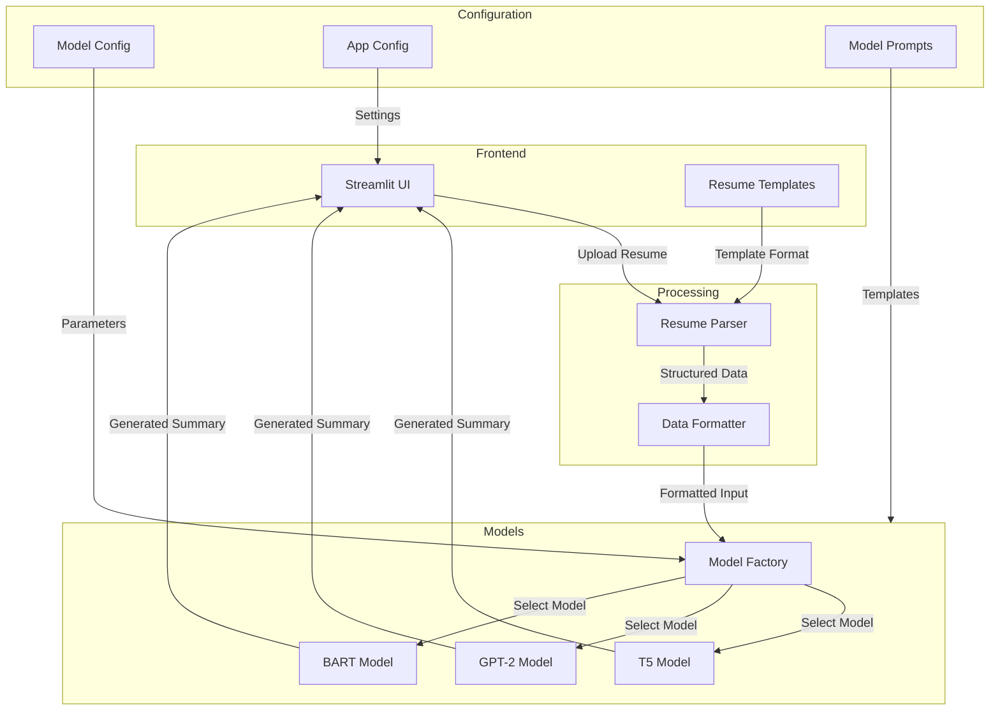

# Resume Summary Generator

A modern AI-powered application that generates professional summaries from resumes using various AI models.

## Features

- 📄 Multiple resume template options
- 🤖 Support for different AI models (T5, GPT-2, BART)
- 🎨 Modern dark-themed UI
- 📊 Detailed resume parsing and analysis
- 💡 Professional summary generation
- ⚡ Real-time processing

## Technical Architecture

### Block Diagram


### Summary Generation Process

1. **Input Processing**
   - User uploads a resume based on provided templates
   - Resume parser extracts structured information:
     - Personal details
     - Work experience
     - Skills
     - Education
     - Achievements

2. **Data Formatting**
   - Raw data is formatted according to model requirements
   - Applies filters and validations:
     - Removes irrelevant information
     - Validates data structure
     - Formats dates and durations

3. **Model Selection & Generation**
   - User selects preferred model:
     - T5: Fast, concise summaries
     - GPT-2: Natural language, creative
     - BART: Balanced, comprehensive
   - Model factory creates appropriate model instance
   - Applies model-specific configurations
   - Generates summary using pre-trained models

4. **Post-Processing**
   - Cleans and formats the generated summary
   - Applies business rules:
     - Maximum sentence limit
     - Filters out irrelevant content
     - Maintains professional tone
   - Formats output for presentation

## Project Structure

```
tv3/
├── src/
│   ├── app.py                    # Main Streamlit application
│   ├── models/                   # Model implementations
│   │   ├── base_model.py        # Base model class
│   │   ├── t5_model.py          # T5 model implementation
│   │   ├── gpt2_model.py        # GPT-2 model implementation
│   │   ├── bart_model.py        # BART model implementation
│   │   └── model_factory.py     # Model factory class
│   ├── parsers/                 # Resume parsers
│   │   ├── ats_parser.py        # ATS format parser
│   │   └── industry_parser.py   # Industry format parser
│   ├── config/                  # Configuration files
│   │   ├── model_config.py      # Model parameters
│   │   ├── app_config.py        # Application settings
│   │   └── model_prompts.py     # Model prompts
│   └── templates/               # Resume templates
├── requirements.txt             # Project dependencies
└── README.md                   # Project documentation
```

## Model Details

### T5 Model
- **Purpose**: Fast and efficient summary generation
- **Strengths**: 
  - Follows structured prompts well
  - Good at extracting key information
  - Fast processing speed
- **Best For**: Quick, concise professional summaries

### GPT-2 Model
- **Purpose**: Natural language generation
- **Strengths**:
  - Natural writing style
  - Good context understanding
  - Professional tone
- **Best For**: Engaging, well-written summaries

### BART Model
- **Purpose**: Comprehensive summary generation
- **Strengths**:
  - Balanced performance
  - Good comprehension
  - Reliable outputs
- **Best For**: Detailed, well-structured summaries

## Prerequisites

- Python 3.8 or higher
- pip (Python package installer)

## Installation

1. Clone the repository:
```bash
git clone <repository-url>
cd tv3
```

2. Create a virtual environment (recommended):
```bash
python -m venv venv
source venv/bin/activate  # On Windows, use: venv\Scripts\activate
```

3. Install the required packages:
```bash
pip install -r requirements.txt
```

## Usage

1. Start the application:
```bash
streamlit run src/app.py
```

2. Access the application in your web browser (typically http://localhost:8501)

3. Follow the steps in the application:
   - Choose a resume template
   - Download and fill out the template
   - Upload your completed resume
   - Select an AI model
   - Generate your professional summary

## Configuration

The application is highly configurable through various configuration files:

### Model Configuration (`model_config.py`)
- Model-specific parameters
- Generation settings
- Token limits
- Beam search parameters

### Application Configuration (`app_config.py`)
- UI layout settings
- Model descriptions
- Summary filtering rules
- Text formatting options

### Prompt Templates (`model_prompts.py`)
- Model-specific prompts
- Section templates
- Summary structure

## Troubleshooting

- If you encounter any model loading issues, ensure you have sufficient disk space and RAM
- For template download issues, verify your internet connection
- If the UI appears broken, try clearing your browser cache

## Contributing

Contributions are welcome! Please feel free to submit a Pull Request.

## License

This project is licensed under the MIT License - see the LICENSE file for details.
