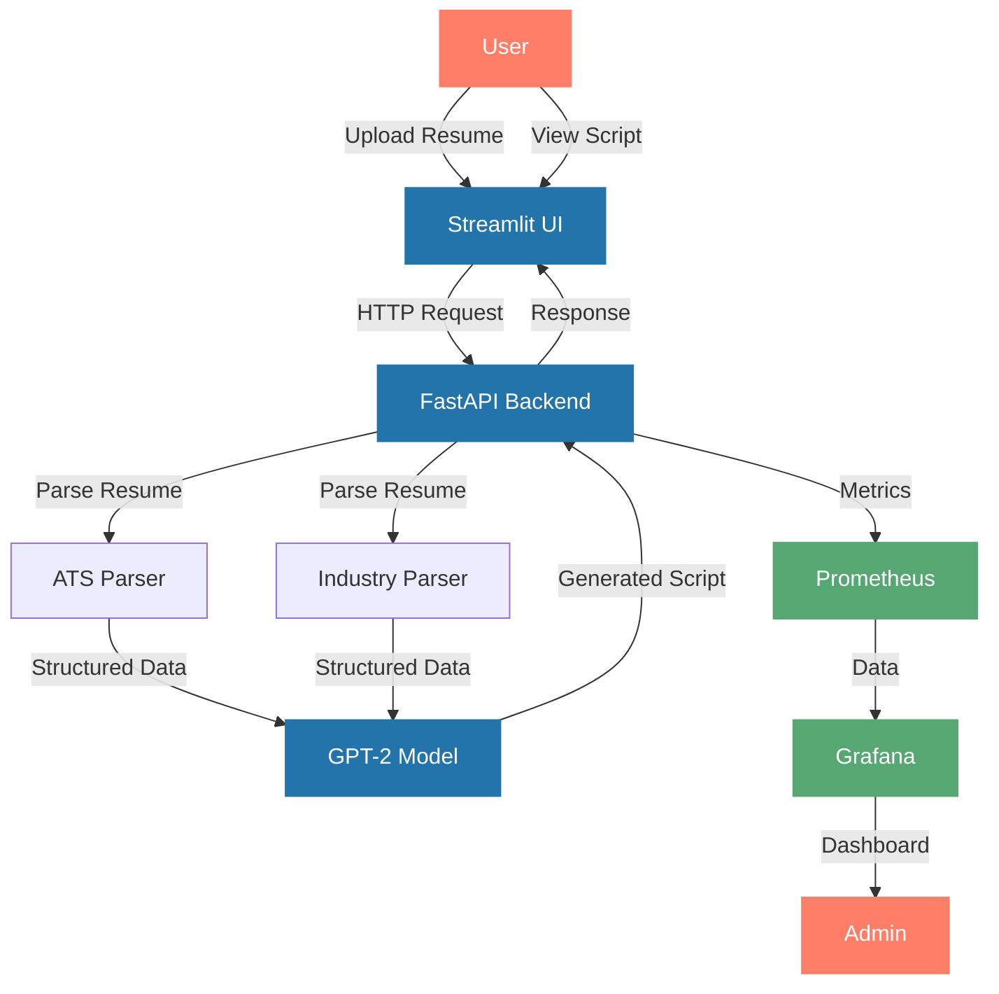

# Resume Video Script Generator

A powerful tool that generates engaging video scripts from resume templates using GPT-2 and modern web technologies.

## System Architecture



## Features

- **Two Resume Templates**
  - ATS/HR Resume: Optimized for HR and recruitment positions
  - Industry Manager Resume: Tailored for industry management roles

- **Modern Web Interface**
  - Streamlit-based UI for easy interaction
  - Real-time script generation
  - Download generated scripts

- **Robust Backend**
  - FastAPI for high-performance API
  - GPT-2 model for natural language generation
  - Specialized parsers for different resume formats

- **Comprehensive Monitoring**
  - Prometheus metrics collection
  - Grafana dashboards
  - Performance and error tracking

## Quick Start

### Prerequisites
- Docker and Docker Compose
- Kubernetes cluster (for production deployment)
- Python 3.11+

### Local Development

1. Clone the repository:
```bash
git clone https://github.com/yourusername/resume-video-generator.git
cd resume-video-generator
```

2. Install dependencies:
```bash
pip install -r requirements.txt
```

3. Run the services:
```bash
# Terminal 1: Run FastAPI
python -m src.api.app

# Terminal 2: Run Streamlit
streamlit run src.ui.streamlit_app.py
```

### Docker Deployment

```bash
# Build and run with Docker Compose
docker-compose up --build
```

### Kubernetes Deployment

1. Deploy core services:
```bash
kubectl apply -f k8s/deployment.yml
kubectl apply -f k8s/service.yml
kubectl apply -f k8s/pvc.yml
```

2. Deploy monitoring stack:
```bash
kubectl apply -f k8s/prometheus-config.yml
kubectl apply -f k8s/prometheus.yml
kubectl apply -f k8s/grafana-config.yml
kubectl apply -f k8s/grafana.yml
```

## Usage Guide

1. **Access the Application**
   - Open http://localhost:8501 in your browser
   - You'll see the Streamlit UI

2. **Generate a Video Script**
   - Select your resume template type (ATS/HR or Industry Manager)
   - Upload your resume in .docx format
   - Click "Generate Video Script"
   - Review and download the generated script

3. **Monitor the System**
   - Access Grafana: http://localhost:3000
   - Default credentials: admin/admin
   - View pre-configured dashboards

## Documentation

- [Models](docs/models.md): Documentation for the GPT-2 model implementation
- [Parsers](docs/parsers.md): Details about resume parsing components
- [Monitoring](docs/monitoring.md): Guide to monitoring and metrics
- [API Reference](docs/api.md): API endpoints and usage

## Directory Structure

```
resume-video-generator/
├── src/
│   ├── api/          # FastAPI backend
│   ├── ui/           # Streamlit frontend
│   ├── models/       # ML models
│   ├── parsers/      # Resume parsers
│   └── templates/    # Resume templates
├── k8s/              # Kubernetes configs
├── docs/             # Documentation
└── tests/            # Test files
```

## Contributing

1. Fork the repository
2. Create your feature branch
3. Make your changes
4. Submit a pull request

## License

This project is licensed under the MIT License - see the [LICENSE](LICENSE) file for details.

## Acknowledgments

- GPT-2 model from OpenAI
- FastAPI for the backend framework
- Streamlit for the UI framework
- Prometheus and Grafana for monitoring
