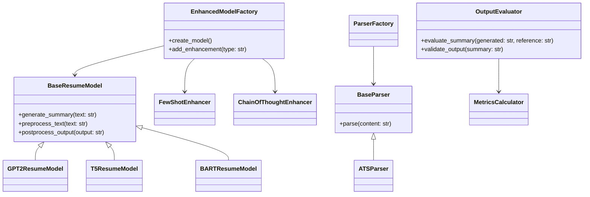

# Documentation

This directory contains detailed documentation for all components of the Resume Summary Generator system.

## Contents

- [Models](./models.md): Documentation for model implementations and factory
  - GPT2ResumeModel
  - EnhancedModelFactory
  
- [Parsers](./parsers.md): Documentation for resume parsing components
  - ParserFactory
  - BaseParser
  - ATSParser
  
- [Enhancers](./enhancers.md): Documentation for generation enhancers
  - FewShotEnhancer
  - ChainOfThoughtEnhancer
  
- [Evaluation](./evaluation.md): Documentation for evaluation components
  - MetricsCalculator
  - OutputEvaluator

## Class Relationships

